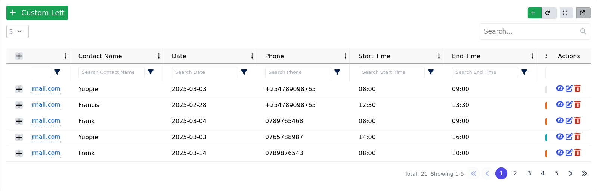
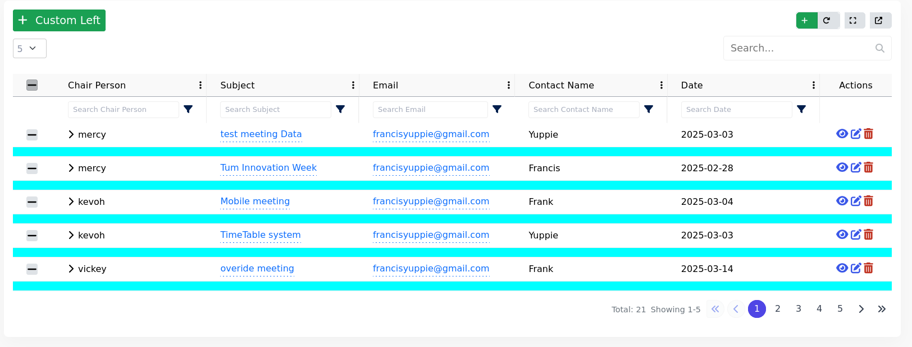
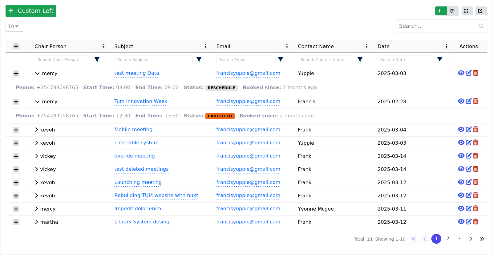
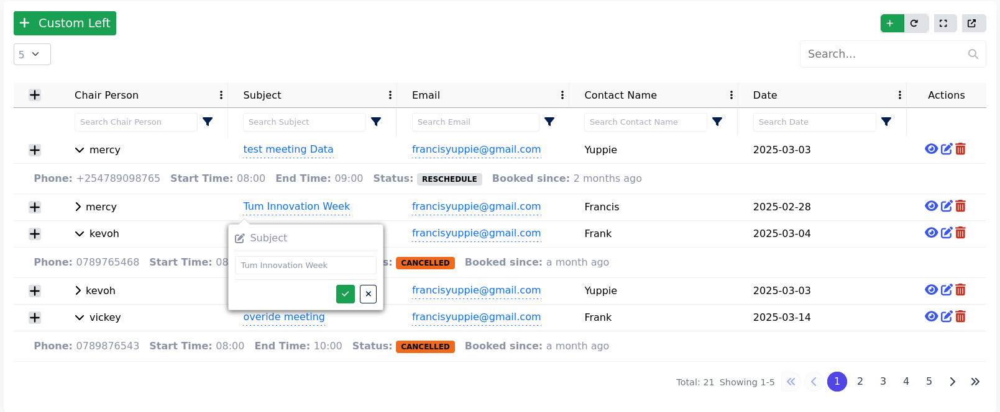

# Omnigrid Overview

A powerful, customizable data grid for Vue.js with advanced features like pagination, inline editing, and multi-column rendering.

 <!-- Replace with actual image -->

## Key Features

### 1. **Dynamic Rendering Modes**
- **Horizontal Scrolling**  
  Handle unlimited columns with smooth horizontal scrolling.  
    

- **Expandable Columns**  
  Extra columns auto-wrap or show in expandable panels.  
  


- **Expand to show Extra Columns**  
  Extra columns auto-wrap or show in expandable panels.  
     

### 2. **Editing & Interactions**
- **Inline Cell Editing**  
  Click cells to edit directly. Supports text, numbers, and dropdowns.
  

  Sample Usage
  ```vue
  <OmniGridView
      :columns="tableColumns"
      :editable-columns="editableColumns"
      :data="tableData"
      :loading="isLoading"
      action-layout="inline"
      :pagination-config="{
        variant: 'circle',
        position: 'right',
        bgColor: '#4f46e5',
        hoverBgColor: '#6366f1',
        textColor: '#374151',
        activeTextColor: '#ffffff',
        showFirstLast: true,
        showNumbers: true,
        showTotal: true,
        showRange: true,
      }"
      :toolbar="{
        show: true,
        showCreateButton: true,
      }"
      :expandable-rows="true"
      :filtering="true"
      :multi-select="false"
      :radio-select="false"
      :break-extra-columns="false"
      :search-in-backend="true"
      @view="handleView2"
      @edit="handleEdit"
      @delete="handleDelete"
      @search="handleSearch"
      @changePage="changePage"
      @update:perPage="updatePerPage"
      @refresh="request"
    >
      // demo slot component
      <template #left-buttons>
        <BaseButton class="btn btn-success btn-sm" @click="showModal" style="font-size: 1.2rem">
          <template #icon>
            <font-awesome-icon :icon="['fas', 'plus']" />
          </template>
          Custom Left
        </BaseButton>
      </template>
      <template #column-status="{ row }">
        <span :class="getStatusClass(row.recordStatus?.theme)">
          {{ row.recordStatus.label }}
        </span>
      </template>
    </OmniGridView>