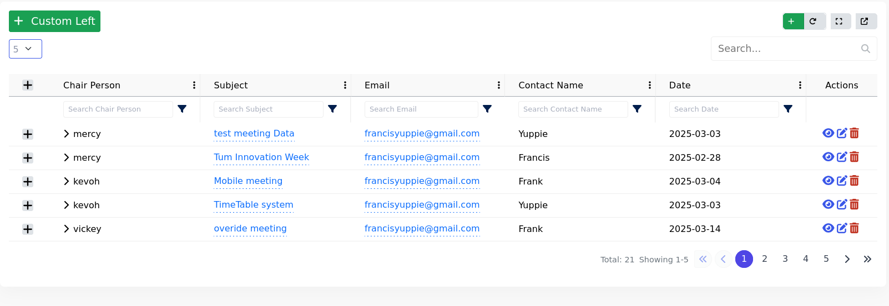

# Omnigrid Usage Guide

## Introduction

Omnigrid is a globally available component in Omniface that provides powerful data grid functionality with minimal setup. No import needed - just use `<OmniGridView>` in your templates.



## Basic Implementation

### 1. Minimal Setup

```vue
<template>
  <OmniGridView :columns="tableColumns" :data="tableData" />
</template>

<script setup>
const tableData = ref({
  data: [],
  paginationData: {
    countOnPage: 0,
    currentPage: 1,
    perPage: 20,
    totalCount: 0,
    totalPages: 0,
    paginationLinks: {},
  },
})

const tableColumns = ref([
  { key: 'userName', label: 'Name' },
  { key: 'email', label: 'Email' },
])
</script>
```

```js
const tableData = ref({
  data: [
    { userName: 'John Doe', email: 'john@example.com' },
    { userName: 'Jane Smith', email: 'jane@example.com' },
  ],
  paginationData: {
    currentPage: 1,
    perPage: 10,
    totalCount: 2,
  },
})
```

## Core Features

### 1. Pagination

```vue
<OmniGridView
  :pagination-config="{
    variant: 'circle',
    position: 'right',
    bgColor: '#4f46e5',
    showTotal: true,
  }"
/>
```

### 2. Toolbar

```vue
<OmniGridView
  :toolbar="{
    show: true,
    showCreateButton: true,
    customButtons: ['export'],
  }"
/>
```

### 3. Row Actions

Handle view/edit/delete events:

```vue
<OmniGridView @view="handleView" @edit="handleEdit" @delete="handleDelete" />
```

```js
const handleView = (row) => {
  console.log('Viewing:', row.id)
}

const handleEdit = (row) => {
  // Your edit logic
}

const handleDelete = async (row) => {
  const confirm = await showConfirmationDialog()
  if (confirm) {
    // Delete logic
  }
}
```

## Advanced Features

### 1. Inline Editing

Inline editing allows users to modify data directly within the grid cells. Here's how to implement it with error handling, loading states, and data refreshing:

### 1.1 Core Structure

```vue
<OmniGridView :editable-columns="[{ key: 'email', onSave: handleEmailUpdate }]" />
```
###  1.2 Implementation Pattern

Use this reusable inline editing function:

```js
const inLineEditing = async (url, data) => {
  const { request, error, isLoading } = useApi(url, 'PUT')
  await request(data)

  if (error.value) {
    return {
      error: error.value.message,
      isLoading: isLoading.value,
    }
  }

  return {
    success: true,
    isLoading: isLoading.value,
    shouldRefresh: true,
  }
}
```

### 1.3 Column Configuration

```js
const editableColumns = [
  {
    key: 'description',  // Column key to enable editing
    onSave: async (value, row) => {
      // 1. Prepare payload
      const payload = {
        name: row.name,
        description: value,
        ...(row.ruleName && { ruleName: row.ruleName })  // Conditional fields
      }

      // 2. Execute API call
      const res = await inLineEditing(
        `/v1/iam/rbac/role/${row.name}`,  // Dynamic endpoint
        payload
      )

      // 3. Handle refresh
      if (res.shouldRefresh) refresh()  // Your data refresh method

      // 4. Return API response
      return res
    }
  }
]
```
### 1.4 Adding Expanded rows

#### Configuration

Enable Row expansion by setting this property to true

```js
 <OmniGridView  :expandable-rows="true">.... </OmniGridView>
```

Adding the Content to be shown in the expanded row

```js
<OmniGridView>
   <template #expanded="{ row }">
         <div class="p-3 bg-light">
           <pre>
             {{ row }}
            </pre
           >
         </div>
  </template>
</OmniGridView>
```

### 2. Custom Columns & Actions Documentation

Customization is a core strength of OmniGridView. Here's how to implement custom columns and actions:

Custom columns allow you to completely control how data appears in your grid cells. While the example shows one approach, you can implement custom columns in various ways:

### 2.1 Custom Columns

Customize cell rendering using Vue slots and helper functions:

```vue
<template #column-status="{ row }">
  <span :class="getStatusClass(row.status)">
    {{ row.statusLabel }}
  </span>
</template>
```

Status Helper Function:

```js
const getStatusClass = (theme) => {
  const themeMap = {
    info: 'bg-info text-white badge',
    success: 'bg-success text-white badge',
    warning: 'bg-warning text-dark badge',
    danger: 'bg-danger text-white badge',
    primary: 'bg-primary text-white badge',
    secondary: 'bg-secondary text-white badge',
    dark: 'bg-dark text-white badge'
  }
  return themeMap[theme] || 'bg-light text-dark badge'
}
```

### 2.2 Custom Actions

Extend grid functionality with additional row actions:

```js
const manageGroupRoles = (role) => {
  modalStore.openModal(
    AssignmentManager,
    {
      entity: role,
      config: {
        title: 'permissions',
        availableTitle: 'Roles & Permissions',
        assignedTitle: 'Roles & Permissions',
        keyField: 'name',
        displayField: 'name',
        getAllEndpoint: `/v1/iam/rbac/role/${role.name}`,
        getAssignedEndpoint: `/v1/iam/rbac/role/${role.name}`,
        assignEndpoint: `/v1/iam/rbac/role/assign/${role.name}`,
        removeEndpoint: `/v1/iam/rbac/role/remove/${role.name}`
      }
    },
    `Manage Permissions for {${role.name}} Role`,
    'xl',  // Modal size
    false, // Fullscreen?
    {
      centered: false,
      scrollable: true
    }
  )
}

const customActions = [
  {
    key: 'manage-role',
    label: 'Manage',
    icon: ['fas', 'shield-halved'],  // FontAwesome icon
    callback: (row) => manageGroupRoles(row),
    show: true,  // Can be boolean or function
    colorClass: 'text-secondary'  // Custom styling
  }
]
```

Pass to Grid:

```js
<OmniGridView
  :actions="customActions"
  ...other-props
/>
```

### 2.3 Combined Implementation Example

```js
<template>
  <OmniGridView
    :columns="tableColumns"
    :editable-columns="editableColumns"
    :data="tableData"
    :loading="isLoading"
    :dropDownPerPageOptions="[10, 25, 50]"
    :actions="customActions"
  >
    <!-- Custom Status Column -->
    <template #column-status="{ row }">
      <span :class="getStatusClass(row.status?.theme)" class="badge">
        {{ row.status?.label }}
      </span>
    </template>
  </OmniGridView>
</template>

<script setup>
// Status styling function
const getStatusClass = (theme) => { /* ... */ }

// Inline editing logic
const inLineEditing = async (url, data) => { /* ... */ }
const editableColumns = [ /* ... */ ]

// Custom action definition
const manageGroupRoles = (role) => { /* ... */ }
const customActions = [ /* ... */ ]
</script>
```

### 2.4 Interactive Elements

```js
<template #column-tags="{ row }">
  <TagEditor :tags="row.tags" @update="updateTags(row, $event)" />
</template>
```

### 2.5 Alternative Approaches

### 1 Component-Based Columns

  ```js
  <OmniGridView>
  <template #column-status="{ row }">
    <StatusIndicator :status="row.status" />
  </template>
</OmniGridView>
  ```


### 2 Dynamic Class Binding

```js
<template #column-status="{ row }">
  <span :class="[
    'badge',
    {
      'bg-success': row.status === 'active',
      'bg-danger': row.status === 'inactive'
    }
  ]">
    {{ row.statusLabel }}
  </span>
</template>
```

Custom columns and actions empower you to create rich, interactive data grids that perfectly match your application's requirements and design language.


### 3. Server-Side Operations

```js
const { data, request } = useApi('/api/records', 'GET')

const handleSearch = (query) => {
  request(null, {
    page: currentPage.value,
    'per-page': itemsPerPage.value,
    _search: query, //pass based on the backend requirement
  })
}

const changePage = (page) => {
  request(null, { page })
}
```

## Complete Example

````vue
<OmniGridView
  :columns="tableColumns"
  :editable-columns="editableColumns"
  :data="tableData"
  :loading="isLoading"
  action-layout="inline"
  :pagination-config="{
    variant: 'circle',
    position: 'right',
    bgColor: '#4f46e5',
    hoverBgColor: '#6366f1',
    textColor: '#374151',
    activeTextColor: '#ffffff',
    showFirstLast: true,
    showNumbers: true,
    showTotal: true,
    showRange: true,
  }"
  :toolbar="{
    show: true,
    showCreateButton: true,
  }"
  :expandable-rows="true"
  :filtering="true"
  :multi-select="false"
  :radio-select="false"
  :break-extra-columns="false"
  :search-in-backend="true"
  @view="handleView2"
  @edit="handleEdit"
  @delete="handleDelete"
  @search="handleSearch"
  @changePage="changePage"
  @update:perPage="updatePerPage"
  @refresh="request"
>
      // demo slot component
      <template #left-buttons>
        <BaseButton class="btn btn-success btn-sm" @click="showModal" style="font-size: 1.2rem">
          <template #icon>
            <font-awesome-icon :icon="['fas', 'plus']" />
          </template>
          Custom Left
        </BaseButton>
      </template>
      <template #column-status="{ row }">
        <span :class="getStatusClass(row.recordStatus?.theme)">
          {{ row.recordStatus.label }}
        </span>
      </template>
    </OmniGridView>
```
````
